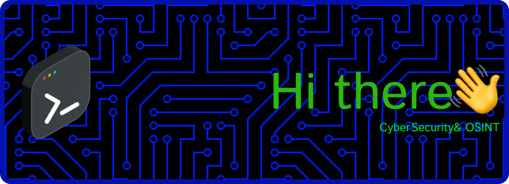

Welcome to my GitHub! I'm a graduate from Columbia University with a specialization in International Security Policy and a concentration in Technology, Media, and Communications. I'm currently enhancing my skills in Open Source Intelligence (OSINT) and cybersecurity, pursuing CompTIA certifications and the McAfee OSINT course.

## What I'm Up To

- 🔭 **Current Projects:** Focused on gaining expertise in OSINT and cybersecurity to apply to real-world scenarios.
- 🌱 **I’m Learning:** Advancing my knowledge in OSINT through structured courses and self-driven exploration.
- 👯 **Collaboration:** Looking to collaborate on projects that leverage OSINT for strategic insights and security enhancements.
- 🤔 **Seeking Help:** Open to advice and collaboration from others in the OSINT and cybersecurity communities.

## Let's Connect!

- 💬 **Ask Me About:** My journey through international security fields and my transition into cybersecurity and OSINT.
- ⚡ **Fun Fact:** I've traveled extensively, which fuels my passion for understanding global security dynamics.

Feel free to reach out if you're interested in OSINT, cybersecurity, or just want to exchange insights on global security issues!

  

